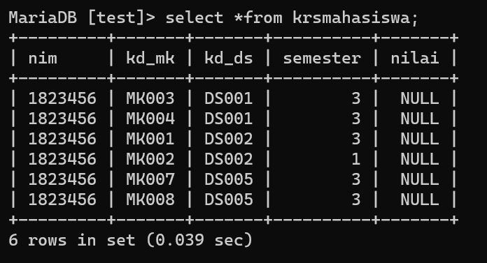
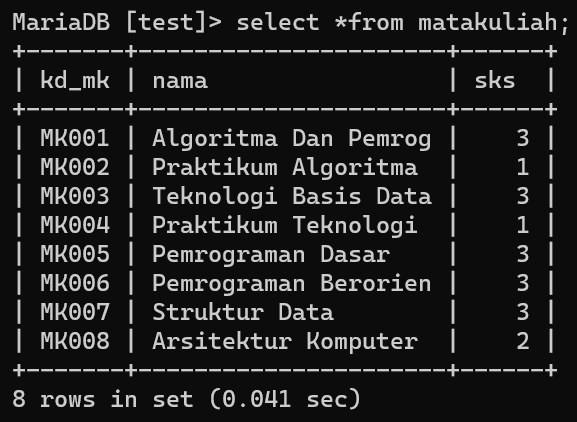
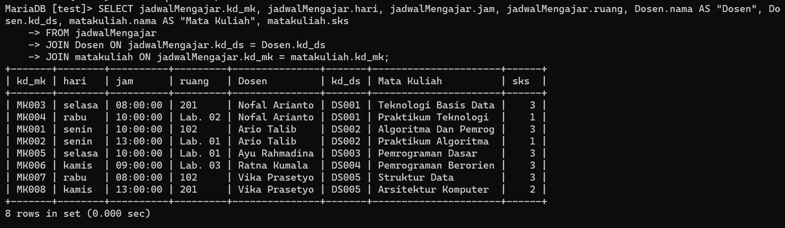
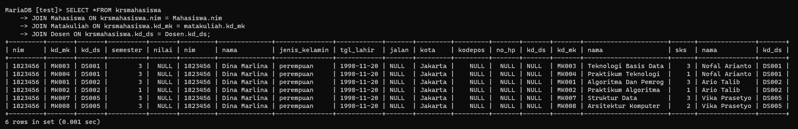

# PRAKTIKUM 5

# CONTOH GAMBAR YANG DI MINTA

- Tabel Mahasiswa

- Tabel Dosen

- Tabel Krsmahasiswa

- Tabel Jadwalmengajar

- Tabel Matakuliah

# TUGAS YANG DI MINTA 

- Lakukan join table Mahasiswa dan Dosen

- Lakukan join tabel Matakuliah dan Dosen

- Lakukan join table JadwalMengajar, Dosen, dan Matakuliah

- Lakukan join tabel KrsMahasiswa, Mahasiswa, matakuliah dosen

 # LATIHAN 

- Kita akan melakukan join tabel pada mahasiswa dan juga dosen dengan menggunakan perintah di bawah ini beserta hasil nya 

- Kemudian join tabel matakuliah dan dosen dengan menggunakan perintah seperti di bawah ini namun tidak di temukan 

- Selanjutnya kita akan melakukan join tabel jadwal mengajar dosen dan juga matakuluan drngan menggunakan perintah di bawah ini 

- Terakhir kita akan melakukan join tabel pada krs mahasiwa mahasiswa matakuliah dosen dengan menggunakan perintah di bawah ini

# LATIHAN 

- JOIN PADA TABEL MAHASISWA DAN DOSEN

- LEFT JOIN TABEL MAHASISWA DAN DOSEN

- JOIN TABEL JADWAL MENGAJAR, DOSEN, DAN MATAKULIAH

- JOIN TABEL JADWAL MENGAJAR JADWAL MENGAJAR MATAKULIAH DOSEN PENGAMPU DAN JADWAL MENGAJAR 

# KESIMPULAN 

JOIN penggabungan table melalui kolom atau key tertentu dimana memiliki nilai terkait untuk mendapatkan satu set data dengan informasi lengkap dengan menggunakan tabel mahasiswa dan dosen

LEFT JOIN menghasilkan nilai berdasarkan table kiri (left table) dan nilai yang sama di table kanan (right table). Jika table kanan tidak sama nilainya dengan table kiri, maka akan diisi nilai NULL pada table kanan dengan menggunakan tabel mahasiswa dan dosen

Konsep RIGHT JOIN hampir sama seperti LEFT JOIN hanya yang menjadi master adalah table kanan (right table). Jika table kiri tidak sama nilainya dengan table kanan, maka akan diisi nilai NULL pada table kiri. Dengan menggunakan tabel jadwal mengajar dosen dan matakuliah
